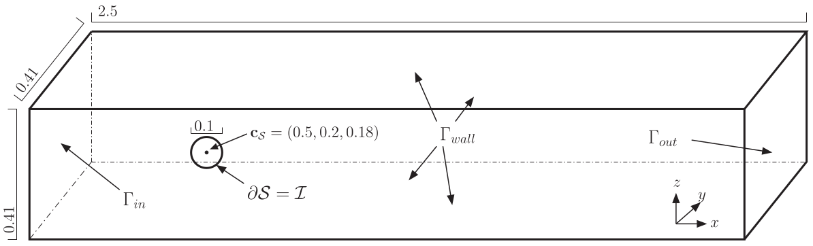

The interaction between a fluid flow and rigid bodies appears in many
physical applications. The flow around a free rigid body causes both
displacement and rotation of that body, via the forces and torque
exerted from the fluid onto the body. Conversely, the motion of the body
causes changes in the flow. The complexity that comes with coupling
models for fluid and elastic or rigid bodies and the numerical
challenges due to evolving geometrical domains make reliable and
benchmark computations very necessary though difficult to perform. This
talk presents a setup that we have designed to particularly investigate
the effects regarding the free rotation of a spherical object in a flow
channel in 2D and 3D. This setup connects to the well known benchmark
of *flow past a cylinder* \[1\] and is accessible to standard CFD
software.

> Figure 1: Spatial configuration of the 3D setup.

In this setup the flow applies a torque force on the object. The induced
rotation then couples back to the flow via the boundary conditions. We
discuss the governing equations of this fluid structure interaction
problem; namely the incompressible Navier-Stokes equations and the
relevant realizations of Newton’s second law that relates the rotation
of the rigid body to the forces acting on it. The proposed benchmark
configurations comprise two and three spatial dimensions and
quasi-stationary (low Reynolds-number) and periodic (high
Reynolds-number) regimes. For a discretization independent comparison of
the results, we also propose significant, nondimensionalized
characteristic values.

The benchmark cases were solved numerically with various approaches and software tools so that the computed characteristic values could be reported within in a reasonable confidence interval.

In this talk, we introduce the mathematical model, discuss the characteristic and challenges of the benchmark cases, and present the various implementation and their particular advantages. The codes that were reported on in our work \[2\] as well as the raw data and postprocessing routines are available \[3\] for further exploration and reproduction.

References
==========

1.  M Schäfer and S Turek: *Benchmark computations of laminar flow around a cylinder. (With support by F. Durst, E. Krause and R. Rannacher)* Flow Simulation with High-Performance Computers II. DFG priority research program results 1993-1995, 1996.

2.  H von Wahl et al.: *Numerical benchmarking of fluid-rigid body interactions*. Computers & Fluids, 2019.

3.  DOI:[10.5281/zenodo.3253455](https://doi.org/10.5281/zenodo.3253455)
