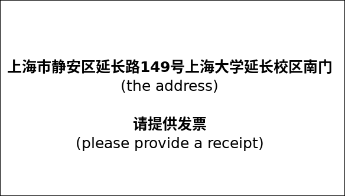

A 5 days workshop on *Machine Learning in Model Reduction and Control* that will be held in Shanghai, China, in October 2019. There will be 40 participants including 15 from Germany and maybe a few from other countries.

{}

# About the Workshop

## Organizers
Peter Benner (MPI Magdeburg), Jan Heiland (MPI Magdeburg), Xin Du (U Shanghai)
## Funding
The workshop is financed by the [*Chinesisch-Deutsches Zentrum f&uuml;r Wissenschaftsf&ouml;rderung* (CDZ)](http://sinogermanscience.dfg.nsfc.cn/de/index.html) and the [Shanghai University](http://www.shu.edu.cn/)
## Date & Venue
October 14--18, 2019 at the Lehu Hotel at the [*Yan Chang* Campus](https://en.wikipedia.org/wiki/Shanghai_University#Yanchang_Campus) of the Shanghai University
## Program
See [here]()

# Participants
## From the *German* side

* Antoulas, Athanasios (Jacobs U Bremen)
* Benner, Peter (MPI for Dynamics of Complex Technical Systems)
* Findeisen, Rolf (OVGU Magdeburg)
* Gosea, Victor (MPI for Dynamics of Complex Technical Systems)
* Gräßle, Carmen (U Hamburg)
* Goyal, Pawan (MPI for Dynamics of Complex Technical Systems)
* Heiland, Jan (OVGU Magdeburg)
* Houska, Boris (ShanghaiTech)
* Manohar, Krithika (Cal Tech)
* Mostaghim, Sanaz (OVGU Magdeburg)
* Noack, Bernd (LIMSI-CNRS)
* Quevedo, Daniel (U Paderborn)
* Worthmann, Karl (TU Ilmenau)
* Villanueva, Mario Eduardo (ShanghaiTech)

# Practical Information

## Accommodation
All participants will be provided a room in the conference hotel. This will be organized by the Chinese side. Accomodation was granted for 6 days and, by default, rooms will be reserved from Sunday (October 13) till Saturday (October 19). If your travel dates differ from that please let us know.

## Visa
Everyone has to take care of his own visa. Generally, the participants need an [*F type* visa](https://www.travelchinaguide.com/embassy/visa/f-visa.htm). For that, the necessary invitation and approval letter will be provided by the Shanghai University. 

Holders of an (Assistant) Professorship are eligible for an [*R type* visa](https://www.travelchinaguide.com/embassy/visa/talent.htm) that is a long time visa for up to 10 years. If you are interested, please let us know. Then the Shanghai University will issue a particular *Confirmation Letter for High Level Foreign Talents*. 

Our practical experience is that, once the documents are complete, the official [visa agency](http://www.visaforchina.org/) provides the visa within a week. They have offices in several German cities and offer postal service too. Officially, however, visa application should happen at least one month before the trip. Thus, starting application for the visa around September 1st should be right in time. 

## Travelling

Everyone should book her own flight. The costs will be reimbursed via the MPI Magdeburg. The regulations^[Das CDZ fördert entsprechend der Fördersätze nationale und internationale Reisen, wobei Visagebühren, Fahrtkosten von und zu Flughäfen oder Bahnhöfen sowie Versicherungskosten eingeschlossen sind. Die Mittel werden als Pauschalen an die Institution des Bewilligungsempfängers der anreisenden Seite Teilnehmenden überwiesen, von dritter die Seite entsprechenden an die Mittel für Institution die des Bewilligungsempfängers der gastgebenden Seite. Wenn ein Umweg zum Reiseziel eingeschlagen oder First Class bzw. Business Class geflogen wird, müssen die so entstandenen Mehrkosten von der betreffenden Person selbst getragen werden.  Die Bewilligungsempfänger müssen die Aufgabe übernehmen, die Reisekosten für die Teilnehmenden abzurechnen. Dafür müssen Sie von allen Teilnehmenden jeweils eine Kopie der ersten Seite des Reisepasses, das E-Ticket und die Original-Rechnung bekommen. [...] Das CDZ übernimmt keine Kosten für Umbuchungen, Stornierungen oder versehentlich doppelt gebuchte Tickets. Durch diese Umstände entstandene Kosten müssen von den betroffenen Personen selbst getragen werden. Wird die Teilnahme durch einen Krankheitsfall verhindert, so übernimmt das CDZ die Stornierungskosten, sofern vom Betreffenden ein ärztliches Attest über die5 Reiseunfähigkeit vorgelegt wird.  Das CDZ übernimmt die Flugkosten auch dann, wenn der Reisende sich vor bzw.  nach der geförderten Veranstaltung im Gastland aufhält, die Aufenthaltszeit darf jedoch nicht mehr als sechs Wochen betragen und die Flugkosten dürfen nicht höher als die der anderen Reisenden sein.] of the CDZ apply. The basic (practical) information is 

 * travelling+visa+insurance costs up to 1700 Euro will be reimbursed
 * you can extend your stay to up to 6 weeks
 * only (the price of the corresponding) economy class tickets will be reimbursed
 * it is OK to go, e.g., to Beijing and use the train to Shanghai
 * make sure to keep your boarding passes
 * you will need an original invoice^[This was always a bit troublesome. It works well with Lufthansa or Hainan Airlines. We always managed somehow to reimburse the costs.]

## Getting there

Shanghai has two main airports *Pu Dong* and *Hong Qiao*. Both airports as well as the train stations are well connected by subway. 

### By Taxi

At any airport or train station just go to the official taxi stands. It might be very crowded but the access to the cars is well organized.

The addresse is 上海市静安区延长路149号上海大学延长校区南门. (The south gate of the Shanghai University at the *Yan Chang* Campus). Walk on as indicated below.

The picture below has the address and the request for a receipt on it. 

### By Metro

The university campus with the conference hotel is reached by the *red line* (Subway Line 1) at stop *Yan Chang Road* (延长路). There, take exit 2 (2口出), turn right so that you have the elevated road in your back, walk straight for 500m. Soon after the first traffic light, you will see the fence of the Shanghai University on the left side of the street. Walk on until the main gate.

### In any case
Enter the campus through the [main gate](https://en.wikipedia.org/wiki/Shanghai_University#/media/File:Shanghai_Universtiry_YanChang_Gate.jpg) which is around [here](https://www.bing.com/maps?osid=521cb239-8661-47b0-8115-969f62c9047f&cp=31.272888~121.458807&lvl=19&v=2&sV=2&form=S00027), turn left at the first T-junction and find the hotel as the second building on the left hand side.
