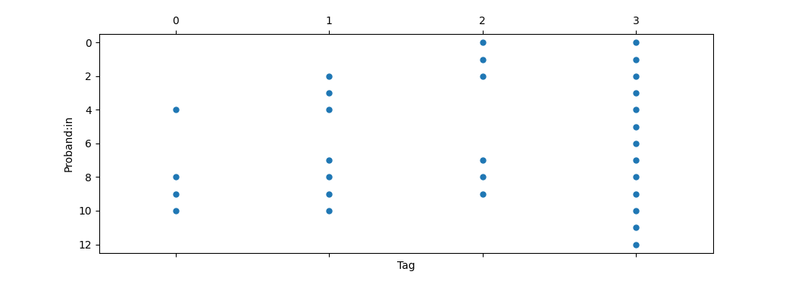
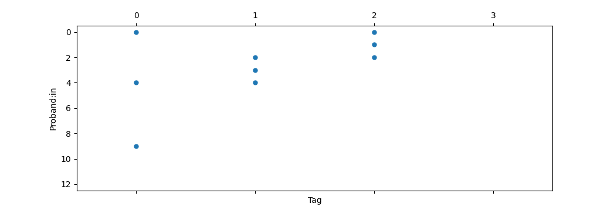

F&uuml;r Sch&uuml;lerUnis bietet sich die Modellierung von Epidemien an, weil
die Mechanismen und die Mathematik im Modell nachvollziehbar sind. Bisher hatte
mich an meinen Versuchen damit aber gest&ouml;rt, dass

1. das Thema etwas tr&uuml;be ist (niemand hat wirklich Lust auf Corona oder
   einen Zombie)
2. Es doch abstrakte Mathe bleibt (wenn beispielsweise im deterministischen
   "SIR"-Modell die Ansteckungsraten einfach angenommen werden)
3. und letztlich die Verbindung zwischen Modell und Person nicht hergestellt
   wird.

## Die Inhalte

Im diesj&auml;hrigen Versuch zu unserer [*Sommeruniversit&auml;t f&uuml;r
Sch&uuml;lerinnen*]() habe ich einen neuen Ansatz probiert. Das feedback war
positiv und somit teile ich gerne meine &Uuml;berlegungen und Materialien hier.

### Motivation

Mit dem *Normalen Kita-Gesetz* 

> Bastelt ein Kind mit Glitzer, dann basteln am Ende alle mit Glitzer

und mit dem Video von [Quarks](https://www.ardmediathek.de/video/quarks/experiment-teil-1-so-schnell-verbreiten-sich-viren/wdr/Y3JpZDovL3dkci5kZS9CZWl0cmFnLWVlMmM5YmRhLTliNmItNDhkMC1iZTMzLWE4YmM5MzAzMmQ4MQ) zum Versuch, wie sich im Restaurant die Handcreme
einer Frau am Ende &uuml;berall befindet, wurde unser Experiment motiviert.

### Aufbau und Experiment

Dann haben sich die Proband:innen um einen Tisch gesetzt und die *Lollipedimie*
durchgespielt. Das ansteckende Element waren Lollies, die ich verteilt oder
eingesammelt habe und der Zufall wurde durch W&uuml;rfeln eingebracht.

Ein Experiment bestand aus dem W&uuml;rfeln reihum und der Gliederung

0. Tag -- eine Infektionsrunde
1. Tag -- zwei Ausbreitungsrunden und eine Genesungsrunde
2. Tag -- zwei Ausbreitungsrunden und eine Genesungsrunde
3. Tag -- zwei Ausbreitungsrunden und eine Genesungsrunde

mit den Regeln

- bei der Infektionsrunde bekam einen Lollie, wer eine :six: gew&uuml;rfelt hat.
- in einer Ausbreitungsrunde bekam einen Lollie, wer eine :five: **oder** :six: warf
  **und** wessen Nachbar:in schon einen Lollie hatte 
- in einer Genesungsrunde wurde der Lollie abgegeben, falls eine :one: **oder**
  :two: geworfen wurde

Es wurden 2 Experimente durchgespielt (gesamt etwa 15 Minuten) und die Anzahl
der Lollies nach jedem Tag an der Tafel protokolliert. Die
Sch&uuml;lerinnen (zwischen 10. und 12. Klasse) hatten es schnell verinnerlicht,
shortcuts ausgemacht (wer keine Nachbarin mit Lollie hat, muss gar nicht
w&uuml;rfeln) und nach dem zweiten Durchgang wollten manche lieber das Angebot
wahrnehmen, die Computersimulation dazu zu sehen. 

> Mit 11 Sch&uuml;lerinnen ist die Varianz in den Ergebnissen eigentlich recht gross. Aber wie es der Zufall wollte, kamen in unseren Experimenten mehr oder weniger die gleichen Werte raus.

### Computersimulation

Die Simulation erm&ouml;glicht in der Tat, das schnelle Durchspielen der
Experimente und illustriert die gro&szlig;en Abweichungen in den Resultaten. 

Auch erm&ouml;glicht es die Simulation, die Anzahl der Teilnehmer:innen im
Stuhlkreis beliebig hoch zu setzen. Die Anwesenden erkannten schnell, dass
mit h&ouml;herer Anzahl, die Prozentzahl der am Ende infizierten, weniger stark
schwankte.

Diese Erkenntnis wurde gefestigt in der nachfolgenden Aufgabe, zu der immer zwei
Sch&uuml;lerinnen einen Datensatz (mit 50 simulierten Durchl&auml;ufen) zu
jeweils einer Anzahl von Proband:innen bekamen und ein vorbereitetes Blatt in
dem durch ausmalen von K&auml;stchen die Daten in ein Histogramm
&uuml;berf&uuml;hrt wurden. Das und die abschlie&szlig;ende gemeinsame
Erkenntnis, dass f&uuml;r gr&ouml;&szlig;ere Gruppen, die Bilder weniger wild
aussehen, kam wirklich gut an.

Das reichte dann auch als input, sodass meine abschlie&szlig;ende Herleitung von
Differentialgleichungen (aus dem Differenzenquotienten der t&auml;glichen bzw.
st&uuml;ndlichen bzw. min&uuml;tlichen bzw. ... &Auml;nderung) zwar
nachvollzogen und aufgenommen wurde, aber letztlich nicht n&ouml;tig gewesen
w&auml;re.

## Materialien

 * gen&uuml;gend Lollies zum Verteilen (vielleicht gehen auch F&auml;hnchen
   o.&auml;h.)
 * W&uuml;rfel und W&uuml;rfelbecher
 * Tafel zur Protokollierung
 * [Simulationsskript](simu-2.py)
 * [Datenblatt (Beispiel)](N26a.pdf), [Ausmalhistogramm](ausmalhistogramm.pdf) und geeignete Stifte zum Ausmalen
 * [alles als zip](allmats.zip) (auch bspw `tikz` code zum Anpassen)

