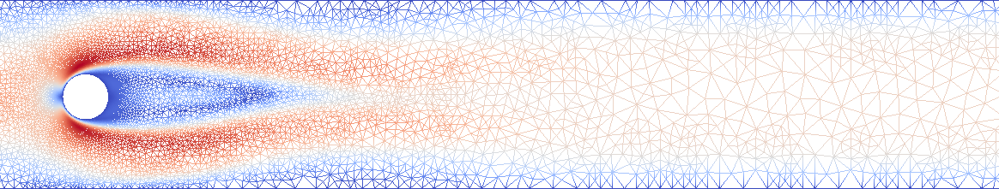
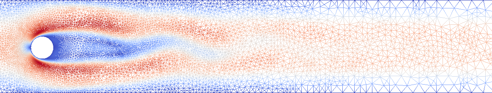

+++
title = "Open Master Thesis"
date = 2020-01-01
draft = false
profile = false

# Tags: can be used for filtering projects.
# Example: `tags = ["machine-learning", "deep-learning"]`
tags = ["BA-MA"]

# Project summary to display on homepage.
summary = "on *DMD models for flow problems based on time series using adaptive grids*"

# Slides (optional).
#   Associate this page with Markdown slides.
#   Simply enter your slide deck's filename without extension.
#   E.g. `slides = "example-slides"` references 
#   `content/slides/example-slides.md`.
#   Otherwise, set `slides = ""`.
slides = ""

# Optional external URL for project (replaces project detail page).
external_link = ""

# Links (optional).
url_pdf = ""
url_code = ""
url_dataset = ""
url_slides = ""
url_video = ""
url_poster = ""

# Custom links (optional).
#   Uncomment line below to enable. For multiple links, use the form `[{...}, {...}, {...}]`.
# links = [{icon_pack = "fab", icon="twitter", name="Follow", url = "https://twitter.com"}]

# Featured image
# To use, add an image named `featured.jpg/png` to your page's folder. 
[image]
  # Caption (optional)
  caption = ""

  # Focal point (optional)
  # Options: Smart, Center, TopLeft, Top, TopRight, Left, Right, BottomLeft, Bottom, BottomRight
  focal_point = ""
+++

# Supervisors
Dr. Carmen Gr&auml;&szlig;le MPI Magdeburg, Jun-Prof. Jan Heiland FMA

# Problem statement:

The method of *Dynamic Mode Decomposition* (DMD) is able to identify a surrogate model for a nonlinear system based on time series (*snapshots*). 
Typically, surrogate models are less complex than the original model equations
so that they can be used to simulate the same phenomena but in less
computation time (*speedup*) and with lower memory requirements (*compression*). 
The theory of DMD is more than 100 years old. In practice, DMD has experienced strong popularity within the last 10 years, mostly due to interesting and successful application examples in flow problems.

In the context of numerical investigation of PDEs in general and flow problems in particular, the *snapshots* can be considered as approximate solutions at given time instances. Each of these approximate solutions are discrete functions which are defined on a spatial mesh. If the mesh is constant over all time instances, DMD is readily applicable.

In this master's thesis, we will pursue the case, in which the mesh changes over time, which is intended in applications. We will develop a formulation for DMD which is independent of the spatial meshes and propose numerical realizations which exceed simple interpolation approaches.

# Requirements

For this work, knowledge or particular interests in the following fields are of advantage: 

 * numerics of partial differential equations and
 * numerical simulation 

as well as programming expertise (most suitable in `Python` or `C++`).

# Contact

In case of interest or request for further details, please contact

 * Dr. Carmen Gr&auml;&szlig;le -- [graessle@mpi-magdeburg.mpg.de](mailto: graessle@mpi-magdeburg.mpg.de)

or

 * Jun.-Prof. Jan Heiland -- [jan.heiland@ovgu.de](mailto: jan.heiland@ovgu.de)

